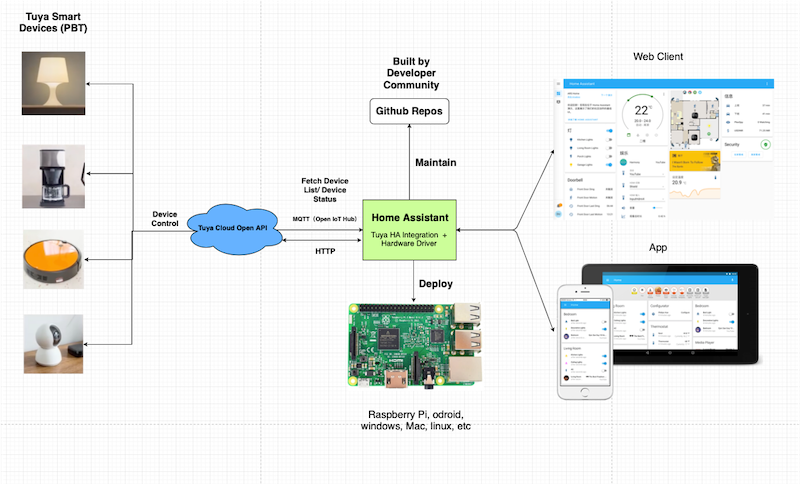

# Tuya Home Assistant Integration

    

This repo is the official home assistant integration for [Tuya Open API](https://developer.tuya.com/en/docs/cloud/?_source=github), maintained by the Tuya Developer Team.

## Supported Device Types

The following Home Assistant device types are currently supported.

- Light: Supports major graffiti wifi light devices
- Switch: Supports wifi switch devices

## Workflow

 

## Sequence Diagram

## Installation

### 1. Home Assistant Installation

Please refer to the [Home Assistant Offcial Installation](https://www.home-assistant.io/installation/) documentation to install **Home Assistant Core**.
You can also get help from [Set up Home Assistant Development Environment on Raspberry Pi](https://developer.tuya.com/en/demo/setuphomeassistantdevenv/?_source=github) in Tuya Developer Demo Center.

### 2. Tuya Home Assistant Integration Installation

There are two methods to install the integration:

1. Home Assistant Custom Components Installation
2. Install by [HACS](https://hacs.xyz/)

#### 2.1 Home Assistant Custom Components Installation

Download this tuya-home-assistant repo, unzip it, and copy the **custom_components/tuya/** folder to the HomeAssistant configuration directory, e.g. ~/.homeassistant

#### 2.2 Install by HACS

1. [HACS Install](https://hacs.xyz/docs/installation/installation/)
2. [HACS Initial Configuration](https://hacs.xyz/docs/configuration/basic)
3. HACS -> Integrations -> ... -> Custom repositories 

4. Input the tuya-home-assistant github https url: https://github.com/tuya/tuya-home-assistant.gi and select "Integration" as the Category type,  then click "ADD"

5. Click "INSTALL"

#### 2.3 Restart Home Assistant

Configuration -> Server Controls -> RESTART

#### 2.4 Activate tuya-home-assistant

Configuration -> Integrations -> ADD INTEGRATION -> Tuya Integration

### 3. Enter your Tuya credential

Please get the Tuya credential info by following the **Configure Cloud Development Project** part in [Tuya IoT Platform Configuration Guide](https://github.com/tuya/tuya-android-iot-app-sdk-sample/blob/activator_tool/Tuya_IoT_Platform_Configuration_Guide.md).

## Start
Please refer to the [Home Assistant Core](https://www.home-assistant.io/installation/) tutorial for the startup process and run
**hass**

## Develop plugins, contribute code

Please refer to the [Contributing.md](./contributing.md) for contributing guide.

## Issue feedback
You can give feedback on issues you encounter via **Github Issue** or via [**Ticket**](https://service.console.tuya.com)

## LICENSE
For more information, please refer to the [LICENSE](LICENSE) file
