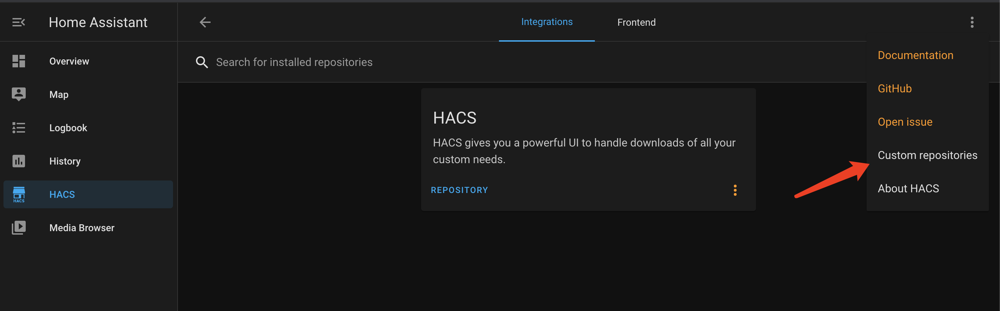
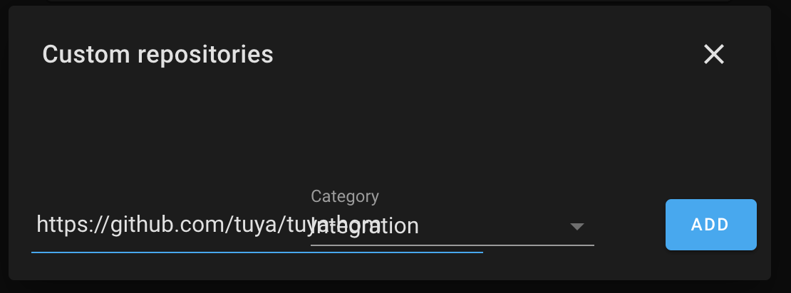
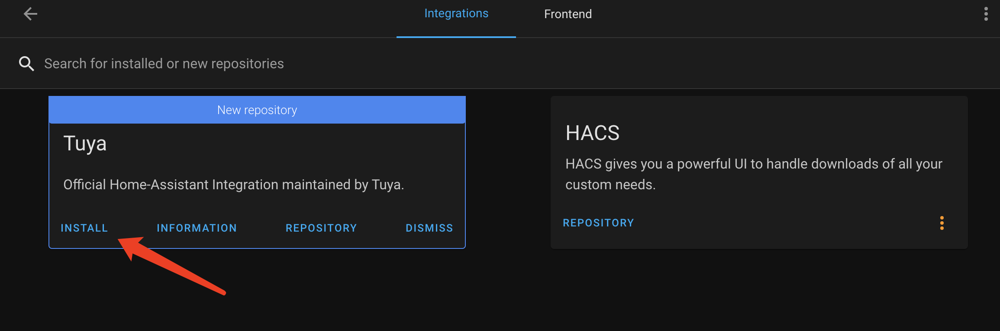
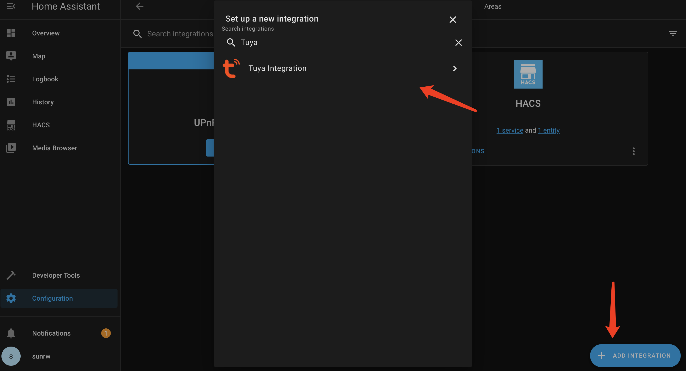
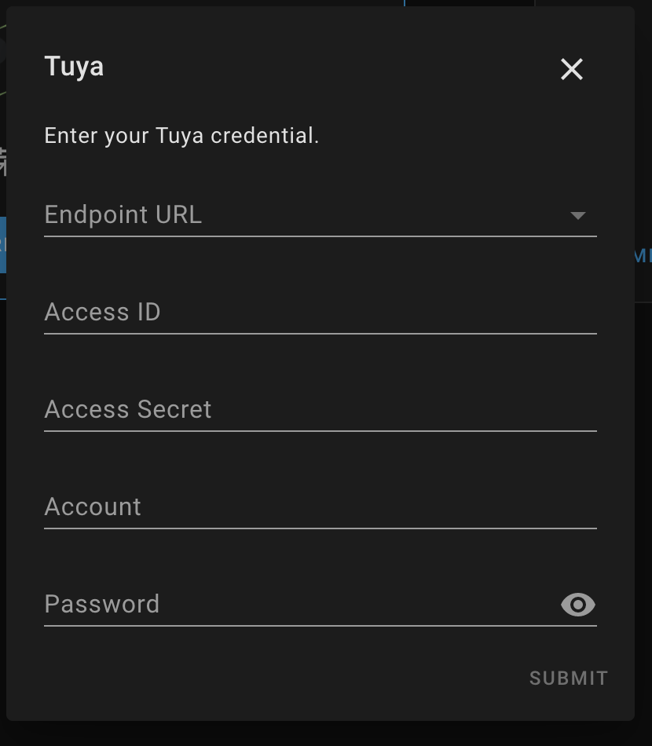

# tuya-home-assistant

tuya-official-homeassistant is the official home assistant integration maintained by Tuya.

## Supported Device Types
The following Home Assistant device types are currently supported.
- Light: Supports major graffiti wifi light devices
- Switch: Supports wifi switch devices

## Installation

### 1. Home Assistant Installation
Refer to the [Home Assistant Installation](https://www.home-assistant.io/installation/) documentation to install **Home Assistant Core**.

### 2. tuya-home-assistant Installation
tuya-home-assistant support two ways to install
1. Home Assistant Custom Components Install
2. Install by [HACS](https://hacs.xyz/)

#### 2.1 Home Assistant Custom Components Install
Download tuya-home-assistant from github, unzip, copy to HomeAssistant configuration directory, e.g. ~/.homeassistant

#### 2.2 Install by HACS
1. [HACS Install](https://hacs.xyz/docs/installation/installation/)
2. [HACS Initial Configuration](https://hacs.xyz/docs/configuration/basic)
3. HACS -> Integrations -> ... -> Custom repositories 

4. Input tuya-home-assistant github https url and select Integration in Category, click "ADD"

5. Click "INSTALL"

#### 2.3 Restart Home Assistant

Configuration -> Server Controls -> RESTART

#### 2.4 Activate tuya-home-assistant

Configuration -> Integrations -> ADD INTEGRATION -> Tuya Integration

### 3. Enter your Tuya credential

## Start
Refer to the **Home Assistant Core** tutorial for the startup process and run
**hass**

## Develop plugins, contribute code
Refer to [Contributing.md](./Contributing.md)

## Issue feedback
You can give feedback on issues you encounter via **Github Issue** or via [**Ticket**](https://service.console.tuya.com)

## LICENSE
For more information, please refer to the [LICENSE](LICENSE) file
